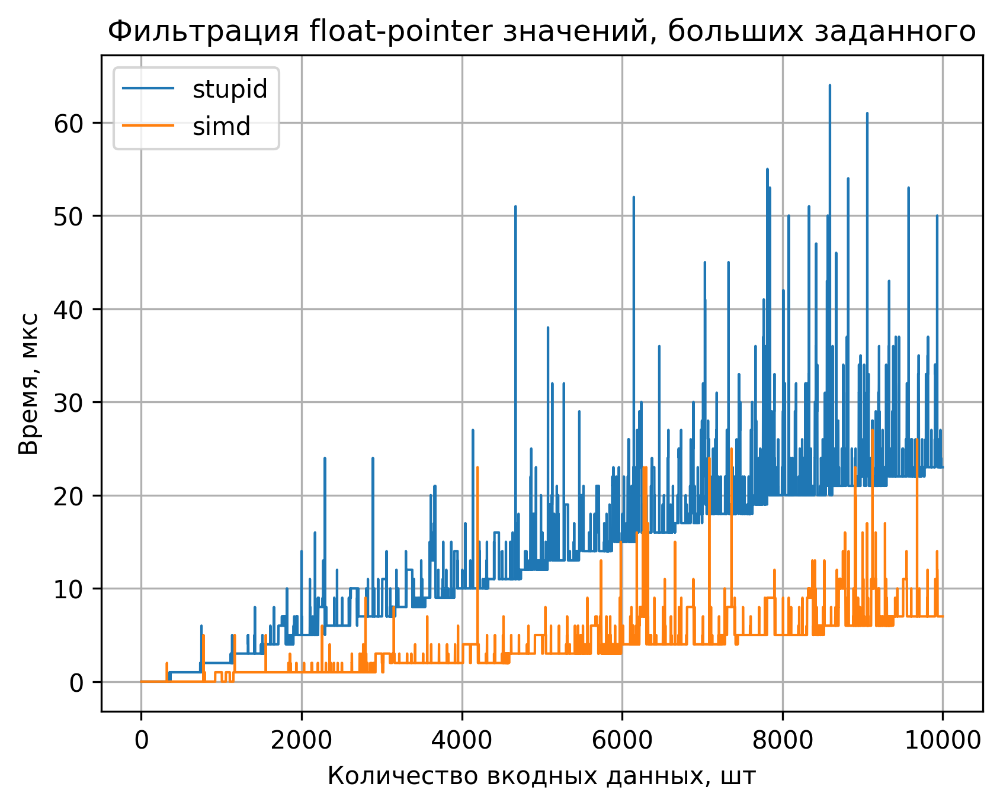
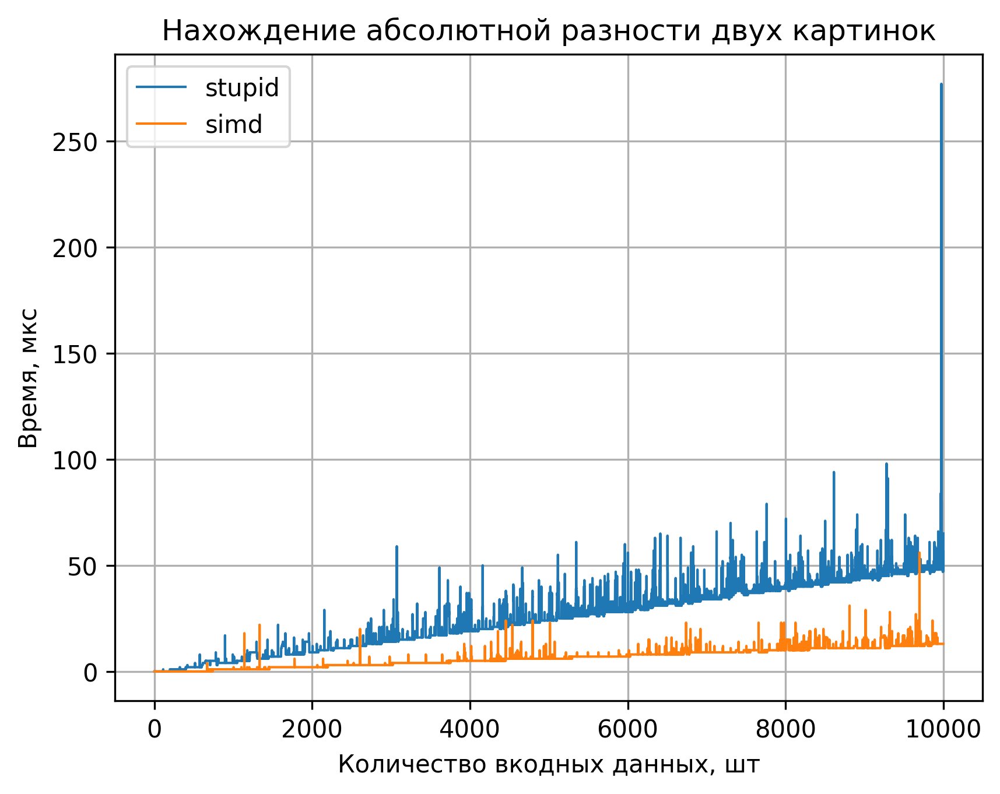
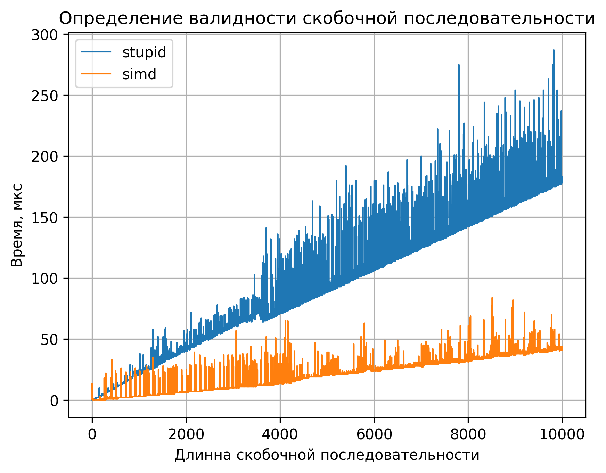

# Highload C++ | ЛР 2

## Задание

## Выполнение задания

### Вариант
Варианты моих заданий согласно таблице: 7, 8, 9

### Общая информация о выполнении

Зайдя на сайт производителя процессора выяснилось, что мой процессор поддерживает AVX и AVX2, поэтому все SIMD решения(по возможности) будут выполнены на 256 битных регистрах.

Также, для для работы интринcиков будет использоваться флаг компиляции -march=native

### Задание 7: Наивное решение

Наивное решение просто проходится по массиву сравнивая значения и переписывая их в новый, тут ничего интересного.

### Задание 7: SIMD решение

Для лучшей демонстрации ускорения решения при использовании SIMD было решено использовать именно float, а не double, чтобы больше вычесляемых значений поместилось в регистр.

Для ускорения алгоритма в 256-разрядный регистр сразу помещается по 8 значений и сравниваються с размноженным в другой регистр пороговым значениием. Если в итоге получается маска 0xFF, значит все значения подходят и сразу весь блок перемещается в результирующий массив. Если маска другая, то переносим значения как и в наимвном решении. Оставшиеся 0-7 значений так же переносим как в наивном решении.

Результаты тестов:

Микросекунд на обработку одного значения:

Наивное:  0.00251917 мкс

SIMD:     0.000618445 мкс

### Задание 8: Наивное решение

Так как в большинстве мне известных библиотек rgba цвет представляется в виде uint32, по 8 бит на канал, то здесь я подготовил данные именно в таком виде.

Наивное решение заключается в обычном проходе по масcиву и вычислении суммы разностей каждого канала в каждом пикселе.

### Задание 8: SIMD решении

В SIMD решении в 256-битный регистр сразу помещается по 32 канала и выполняется операция абсолютной разности, интринсик для которой уже существует. 

Результат тестов:

Микросекунд на обработку одного пикселя:

Наивное:  0.00495428 мкс

SIMD:     0.00116442 мкс

### Задание 9: Наивное решение

Задача очень классическая(особенно для одного типа скобочек), поэтому наивное решение не вызвало проблем: необходимо просто идни по массиву и считать то, что на каждом этапе количество закрывающих скобочек не станет больше открывающих.

### Задание 9: SIMD решении

Решение этой задачи через SIMD было самым сложным, так как сложно было проанализировать список уже существующих инструкций, чтобы найти какие могут подойти.

По-итогу решение выглядит так: подгружаем символы скобочек в 256-битный регистр, накладываем на них маску, состояющую из '(' и ставим '+1' везде, где '(' и '-1' там, где ')'. Сумма будет показывать изменение за 32 скобочки. Осталось только проверить корректность последовательности внутри регистра. Для этого сдвигами создадим общий регистр, чочтоящий из префиксных сумм, а потом найдем в нем минимум. Если минимум c уже накопленной суммой открытых скобок отрицательный, то последовательность невалидна. Остатки опять досчитываются наивно.

Результат тестов:

Микросекунд на обработку одного символа:

Наивное:  0.0193745 мкс

SIMD:     0.00389964 мкс

