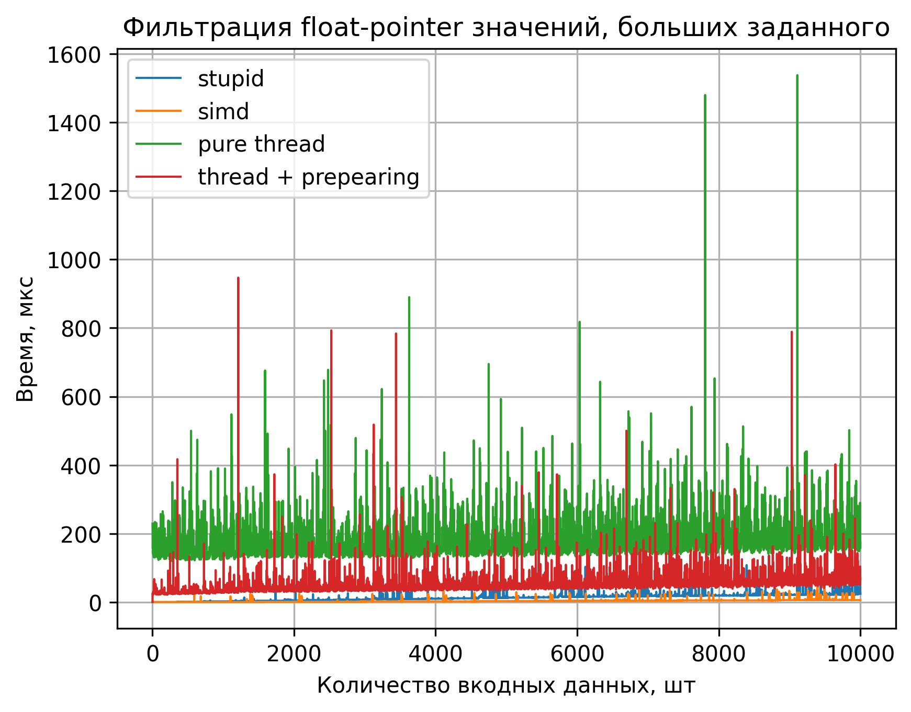

# Highload C++ | ЛР 3

## Задание

Необходимо написать свою реализацию пула потоков, предоставляющую следующий интерфейс:

class ThreadPool {
public:
    template<typename Fn, typename T>
    std::future<T> dispatch_task(Fn && f);
}

Реализация должна позволять задавать число потоков, выполняющих задачи. При добавлении в пул потоков большего количества задач, чем потоков, задачи должны попадать в очередь. Деструктор пула потоков должен отрабатывать корректно, дожидаясь выполнения всех поставленных в очередь задач.

В зависимости от варианта, необходимо использовать разные примитивы синхронизации внутри пула потоков:
0 - Мьютексы и условные переменные.
1 - Атомарные переменные и спиннящиеся на них потоки.

Затем, необходимо взять любой из своих вариантов второй работы, и реализовать его многопоточную версию (без SIMD). Нужно сравнить ускорение от многопоточной реализации с обычной и SIMD версией. Помимо этого, нужно оценить накладные расходы на распараллеливание кода.

## Выполнение задания

### Вариант

Мой номер ИСУ: 336739

Номер задания: 336739 % 2 = 1

### Общая информация о выполнении

Был реализован класс Spin_lock для блокировок и класс Thread_pool для управления потоками и данными, в них обрабатывающихся. Сама задача была написана наивно в лямбда-функции.

Результат тестов получился немного странным: куда я только не пихал счетчики времени: в деструкторы thread-пула, делал атомарными и измерял прямо в потоках: время получалось хуже чем даже при простом наивном решении. Вероятно, данная задача лучше решается в одном потоке из-за оптимизаций компилятора/аппаратных ускорений.

Результат тестов:

Микросекунд на обработку одного символа:

Наивное:  0.0193745 мкс

SIMD:     0.00389964 мкс

Потоки, без затрат на распаралеливание: 0.0318301

Потоки, с затратами на распаралеливание: 0.162864

